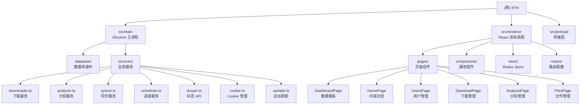

# CLAUDE.md

This file provides guidance to Claude Code (claude.ai/code) when working with code in this repository.

---

# dYm - 抖音视频下载与智能分析管理工具

## 项目概述

dYm 是一款基于 Electron + React 的桌面应用，旨在为用户提供：
- **批量下载管理**：支持多用户、多任务的抖音视频批量下载
- **智能内容分析**：集成 Grok Vision API，自动为视频生成标签、分类、摘要、内容评级
- **本地化存储**：使用 SQLite 数据库实现完全本地化的数据管理
- **自动化调度**：支持定时同步用户作品、自动触发分析任务
- **可视化看板**：提供数据统计、趋势分析、标签分布等可视化图表

---

## 架构总览

### 技术栈

| 层级 | 技术选型 |
|------|---------|
| **桌面框架** | Electron 39.x |
| **前端框架** | React 19.x + TypeScript 5.x |
| **状态管理** | Redux Toolkit |
| **路由** | React Router v7 |
| **UI 库** | Tailwind CSS 4.x + Radix UI + shadcn/ui |
| **数据库** | better-sqlite3 (SQLite) |
| **构建工具** | electron-vite + electron-builder |
| **视频处理** | fluent-ffmpeg (内置 ffmpeg/ffprobe) |
| **下载核心** | [dy-downloader](https://github.com/Everless321/dyDownload) |
| **数据可视化** | Recharts |
| **E2E 测试** | Playwright |

### 架构模式

```
┌─────────────────────────────────────────────┐
│          Electron 主进程 (Main)              │
│  - IPC 通信中心                               │
│  - 数据库操作 (SQLite)                        │
│  - 文件系统管理                               │
│  - 业务服务调度                               │
│  - 系统托盘 / 自动更新                         │
└──────────────┬──────────────────────────────┘
               │ IPC (contextBridge)
┌──────────────┴──────────────────────────────┐
│         Preload 桥接层 (Preload)             │
│  - 暴露安全的 API 给渲染进程                   │
│  - 类型定义与约束                             │
└──────────────┬──────────────────────────────┘
               │ window.api.*
┌──────────────┴──────────────────────────────┐
│       React 渲染进程 (Renderer)              │
│  - UI 界面渲染                                │
│  - 状态管理 (Redux)                           │
│  - 路由导航                                   │
│  - 用户交互                                   │
└─────────────────────────────────────────────┘
```

---

## 模块结构图



---

## 模块索引

| 模块路径 | 名称 | 类型 | 描述 | 文档链接 |
|---------|------|------|------|---------|
| `src/main` | Electron 主进程 | backend | 处理 IPC 通信、数据库操作、文件系统、服务调度 | [查看详情](./src/main/CLAUDE.md) |
| `src/renderer` | React 渲染进程 | frontend | UI 界面、路由、状态管理、用户交互 | [查看详情](./src/renderer/CLAUDE.md) |
| `src/preload` | Preload 桥接层 | bridge | 通过 contextBridge 暴露安全 API | [查看详情](./src/preload/CLAUDE.md) |

---

## 运行与开发

### 环境要求
- Node.js 18+
- npm 或 pnpm
- macOS / Windows / Linux

### 安装依赖
```bash
npm install
```

### 开发模式
```bash
npm run dev
```
启动 Electron 应用，支持热重载（主进程需手动重启，渲染进程自动刷新）。

### 构建打包

#### 编译但不打包
```bash
npm run build:unpack
```

#### 各平台打包
```bash
npm run build:win    # Windows (.exe)
npm run build:mac    # macOS (.dmg)
npm run build:linux  # Linux (.AppImage, .deb)
```

### 代码质量

```bash
npm run lint          # ESLint 检查
npm run format        # Prettier 格式化
npm run typecheck     # TypeScript 类型检查
```

### E2E 测试
```bash
npm run test:e2e      # 运行 Playwright 测试
npm run test:e2e:ui   # 打开 Playwright UI
```

---

## 测试策略

- **E2E 测试**：使用 Playwright 测试主要用户流程（配置在 `playwright.config.ts`）
- **手动测试**：开发模式下通过真实场景验证功能（Cookie 配置、下载、分析等）
- **无单元测试**：当前版本未配置单元测试框架

---

## 编码规范

### TypeScript 规范
- **严格模式**：启用 `strict` 模式，确保类型安全
- **命名约定**：
  - 组件：PascalCase（如 `UserPage.tsx`）
  - 函数/变量：camelCase（如 `startDownloadTask`）
  - 常量：UPPER_SNAKE_CASE（如 `MAX_FFMPEG_CONCURRENCY`）
  - 类型/接口：PascalCase（如 `DbUser`、`SyncProgress`）

### React 规范
- **Hooks 优先**：使用函数组件 + Hooks，避免类组件
- **组件拆分**：页面组件放在 `pages/`，通用组件放在 `components/`
- **状态管理**：复杂状态使用 Redux Toolkit，局部状态使用 `useState`

### IPC 通信规范
- **命名格式**：`<模块>:<动作>`（如 `user:add`、`download:start`）
- **错误处理**：所有 IPC handler 必须处理异常并返回有意义的错误信息
- **类型定义**：在 `src/preload/index.d.ts` 中声明所有 API 类型

### 文件组织
```
src/
├── main/              # 主进程
│   ├── index.ts       # 入口 + IPC handlers
│   ├── database/      # 数据库模块
│   └── services/      # 业务服务
├── preload/           # 桥接层
│   ├── index.ts       # API 暴露
│   └── index.d.ts     # 类型定义
└── renderer/          # 渲染进程
    └── src/
        ├── main.tsx   # React 入口
        ├── routes/    # 路由配置
        ├── pages/     # 页面组件
        ├── components/# 通用组件
        ├── store/     # Redux Store
        └── lib/       # 工具函数
```

---

## AI 使用指引

### 与 AI 协作时的建议

#### 修改主进程代码时
1. **理解 IPC 机制**：主进程通过 `ipcMain.handle` 注册处理函数，渲染进程通过 `window.api.*` 调用
2. **数据库操作**：所有数据库操作集中在 `src/main/database/index.ts`，保持事务一致性
3. **文件路径处理**：注意 Windows/macOS/Linux 路径差异，使用 `path.join` 而非字符串拼接
4. **错误处理**：务必在 IPC handler 中捕获异常，避免主进程崩溃

#### 修改渲染进程代码时
1. **组件拆分**：页面级组件应拆分为多个小组件，提高可维护性
2. **状态同步**：涉及多页面共享的状态（如用户列表）应放入 Redux，局部状态使用 `useState`
3. **样式规范**：使用 Tailwind CSS 原子类，复杂样式可抽取到 `@apply` 指令
4. **类型安全**：调用 `window.api.*` 时确保类型正确，参考 `src/preload/index.d.ts`

#### 添加新功能时
1. **数据库迁移**：需要新增字段时，在 `initDatabase()` 中添加 `ALTER TABLE` 语句（已有防重复机制）
2. **IPC 通道**：新增 API 时，需要同时修改三处：
   - `src/main/index.ts`（注册 handler）
   - `src/preload/index.ts`（暴露 API）
   - `src/preload/index.d.ts`（类型定义）
3. **进度通知**：长时间任务（下载、分析、同步）应通过 `webContents.send` 发送实时进度

#### 常见问题排查
- **数据库锁定**：SQLite WAL 模式已启用，但仍需避免并发写入冲突
- **路径不存在**：文件操作前使用 `existsSync` 检查，必要时使用 `mkdir` 递归创建
- **Cookie 失效**：抖音 Cookie 有效期约 7-30 天，需在设置页重新获取
- **ffmpeg 路径**：生产环境需处理 asar 解包路径（`app.asar.unpacked`）

---

## 配置说明

### Electron Builder 配置
- **文件**: `electron-builder.yml`
- **关键点**:
  - `asarUnpack`: ffmpeg/ffprobe 二进制需解包
  - `mac.identity: null`: macOS 禁用签名（用户需手动签名）
  - `win.forceCodeSigning: false`: Windows 不强制签名

### Vite 配置
- **文件**: `electron.vite.config.ts`
- **关键点**:
  - 主进程、渲染进程、preload 分别配置
  - 支持热重载与类型检查

### Tailwind 配置
- **文件**: `tailwind.config.js`
- **使用**: Tailwind CSS v4，配合 `@tailwindcss/postcss`

---

## 常见问题 (FAQ)

### Q1: 如何调试主进程？
A: 开发模式下，主进程日志会输出到终端。可在 VSCode 中配置 `launch.json` 附加调试器。

### Q2: 如何刷新过期的 Cookie？
A: 进入「设置 → 系统设置」，点击「获取 Cookie」按钮，在弹出的窗口中登录抖音。

### Q3: 视频分析失败怎么办？
A: 检查：
1. Grok API Key 是否正确（在「设置 → 分析设置」配置）
2. API 配额是否充足
3. 视频文件是否完整（可在「文件管理」中检查）

### Q4: 如何批量删除用户文件？
A: 在「文件管理」页面，选择用户后点击「删除所有文件」，会同时删除数据库记录和本地文件。

### Q5: 定时同步如何配置？
A: 在「用户管理」页面，编辑用户设置，启用「自动同步」并配置 Cron 表达式（如 `0 2 * * *` 表示每天凌晨 2 点）。

---

## 相关资源

- **GitHub 仓库**: [Everless321/dYmanager](https://github.com/Everless321/dYmanager)
- **下载核心**: [dy-downloader](https://github.com/Everless321/dyDownload)
- **问题反馈**: [Issues](https://github.com/Everless321/dYmanager/issues)
- **许可证**: [GPL v3](LICENSE)

---

## 免责声明

本工具仅供学习和研究使用，请遵守相关法律法规和平台服务条款。下载的内容版权归原作者所有。
